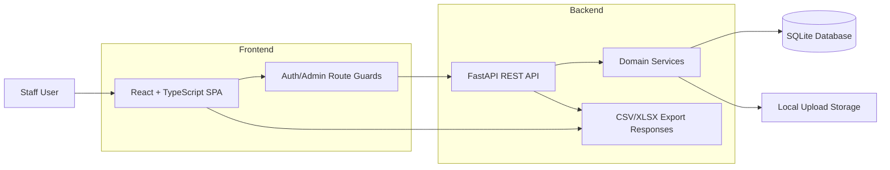
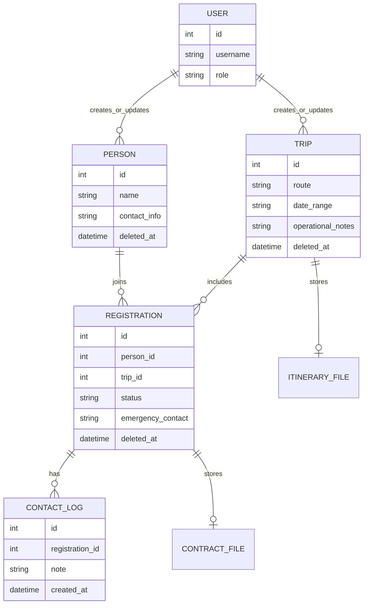
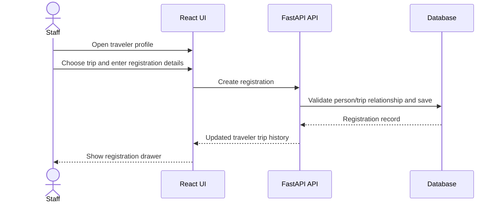
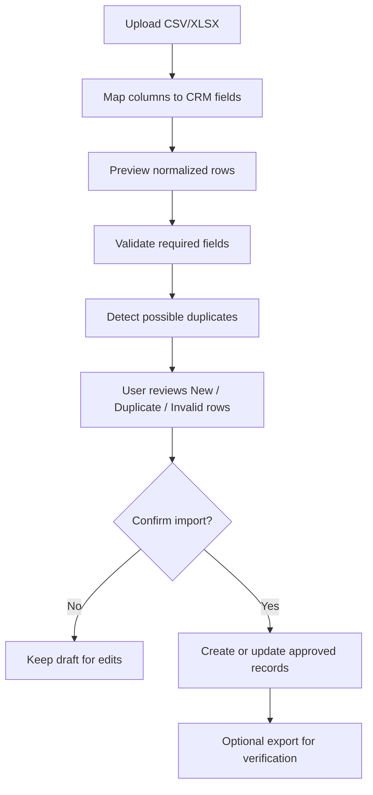

# Travel Operations CRM

A sanitized portfolio display for a private full-stack customer relationship management system used to coordinate travelers, group trips, registrations, contracts, follow-up notes, imports, exports, and admin recovery workflows.

This folder is designed to be published by itself. It explains the product, architecture, data model, and user workflows without exposing company source code, credentials, customer records, internal deployment details, uploaded files, or business-specific data.

## Project Snapshot

Travel Operations CRM helps a small operations team manage the relationship between:

- `People`: traveler or customer profiles.
- `Trips`: group departures or custom travel programs.
- `Registrations`: the link between one person and one trip, including status, documents, payment readiness, emergency contacts, and notes.
- `Contact logs`: trip-specific follow-up history.
- `Files`: itinerary and contract uploads.
- `Admin controls`: users, soft deletes, restoration, and audit metadata.

The core product decision was to model a traveler and a trip separately, then store operational details on the registration between them. That keeps customer profiles clean while preserving trip-specific information for each departure.

## Public Demo Materials

- [Architecture Overview](./docs/ARCHITECTURE.md)
- [Workflow Guide](./docs/WORKFLOWS.md)
- [Demo Script](./docs/DEMO_SCRIPT.md)
- [Data Privacy And Redaction Notes](./docs/PRIVACY_AND_REDACTION.md)
- [Technical Highlights](./docs/TECHNICAL_HIGHLIGHTS.md)
- [Diagram Source Files](./diagrams)

## Screenshots

All screenshots shown here use redacted or demonstration data. They are included to show the product experience while keeping private company records out of the public repository.

### People Directory

The people directory gives staff a searchable view of traveler records with profile details, trip participation, sorting, view controls, import access, and export tools.

### Person Detail And Trip History

The person detail page keeps a traveler's profile and trip history together. Staff can review contact information, see trip participation, and open trip-specific registration records without losing the broader customer context.

### Trip Directory

The trip directory provides a high-level view of group departures. It helps the team scan dates and routes, compare traveler counts, and open detailed trip records for operational updates.

### Trip Detail

The trip detail view combines itinerary information, editable trip fields, traveler status summaries, export actions, and the traveler list for a departure.

The lower portion of the trip workflow shows traveler-facing operational data used to confirm registration status, payment readiness, cancellations, and follow-up needs.

### User Creation

The user creation page is an admin-only area for controlled account setup.

### Soft Deletes

The soft deletes area gives admins a recovery workflow for records that should not immediately disappear forever. Deleted people, trips, registrations, and contracts can be reviewed and restored when needed.

### Import Review Workflow

The import workflow maps spreadsheet columns, previews incoming rows, flags invalid or duplicate entries, and lets staff confirm the final import before records are created.

## System Architecture

For a more detailed view, see [Architecture Overview](./docs/ARCHITECTURE.md).

## Core Data Model

## Representative Workflows

### Add A Traveler To A Trip

### Import Spreadsheet Records

More workflows are documented in [Workflow Guide](./docs/WORKFLOWS.md).

## Tech Stack

- Frontend: React, TypeScript, Vite, React Router, TanStack Query, React Hook Form, Zod
- Backend: FastAPI, SQLAlchemy, Pydantic
- Data workflows: CSV and XLSX import/export
- Auth: token-based login with protected routes and admin-only views
- Deployment shape: Docker-ready frontend and backend services
- Storage: relational database plus local upload storage for contracts and itineraries

## What This Demonstrates

- Full-stack product design for a real operational workflow.
- Relational modeling for many-to-many business entities with workflow-specific fields.
- Protected user sessions and role-based admin controls.
- File upload handling for contracts and itineraries.
- Import review UX with mapping, validation, duplicate detection, draft behavior, and final confirmation.
- Soft-delete recovery for records that need a safety net.
- Export workflows that respect filtering and operational status.
- Dockerized deployment shape with a frontend reverse proxy to the API.

## Privacy Boundary

This public package intentionally omits:

- Source code for private business logic.
- Real company names, customers, phone numbers, emails, addresses, staff names, and trip records.
- Credentials, tokens, production URLs, environment values, and deployment hosts.
- Uploaded contracts, itineraries, invoices, recordings, and private links.
- Financial figures and business-specific operational data.

