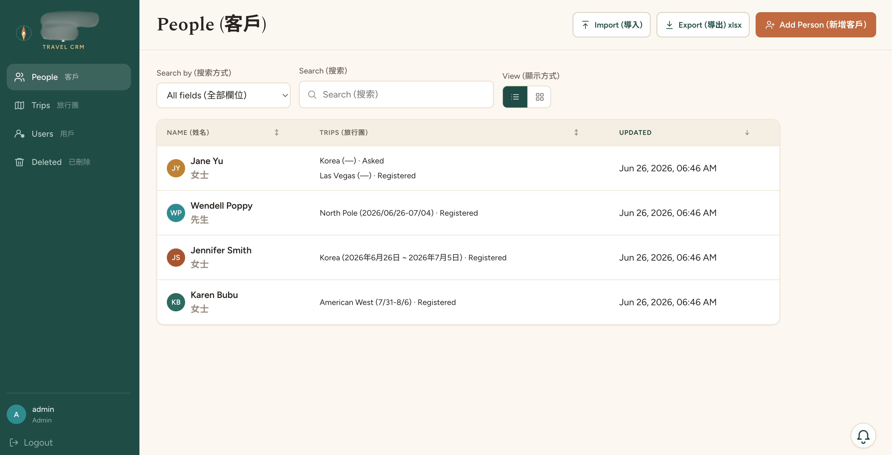
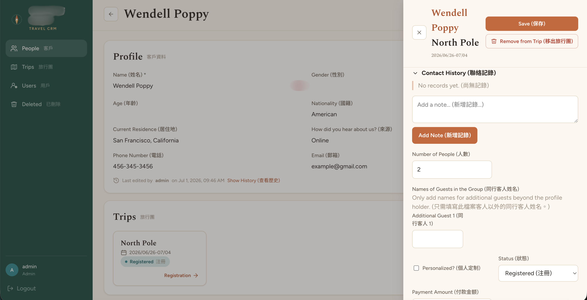
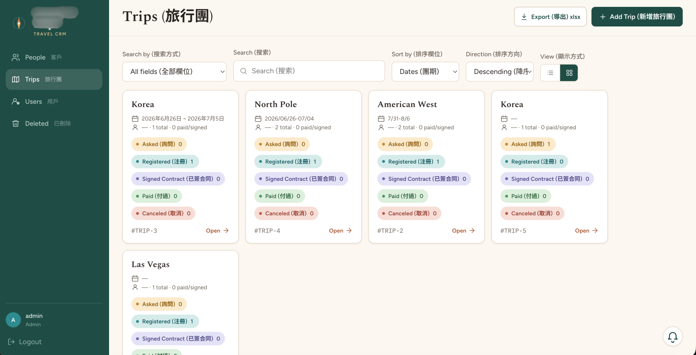
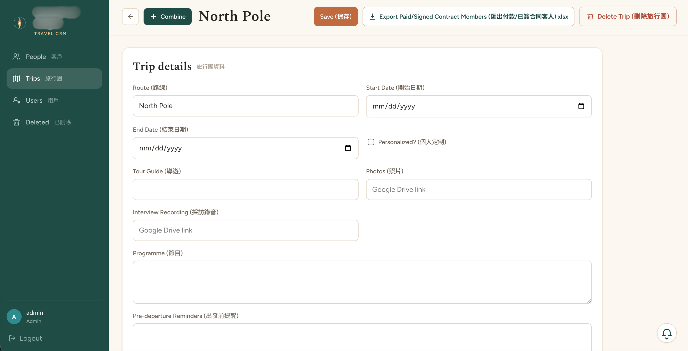
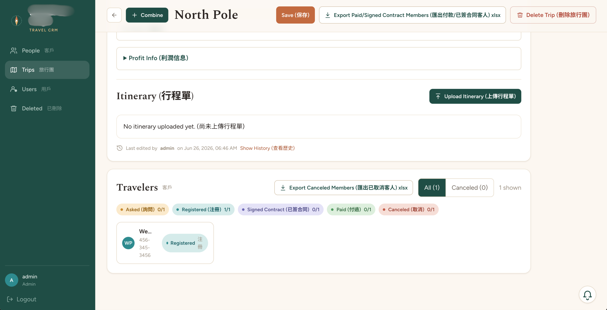
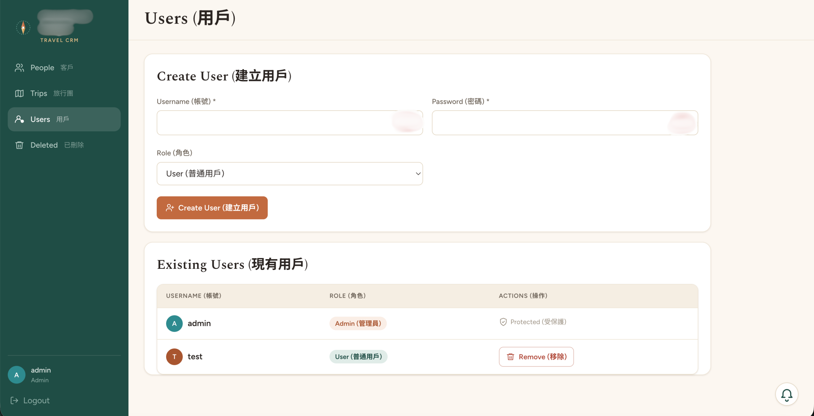
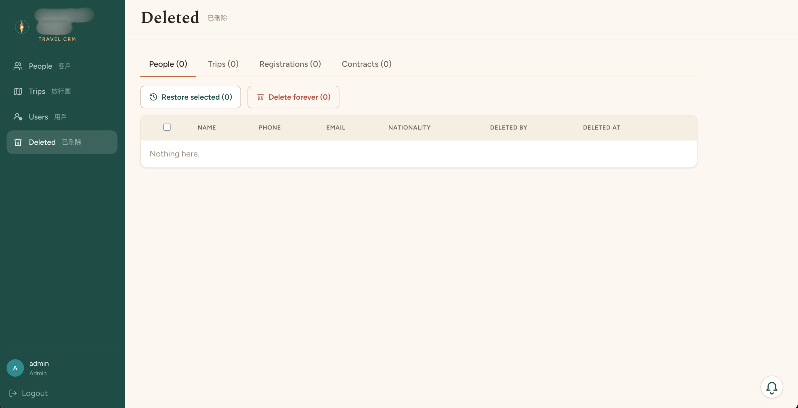
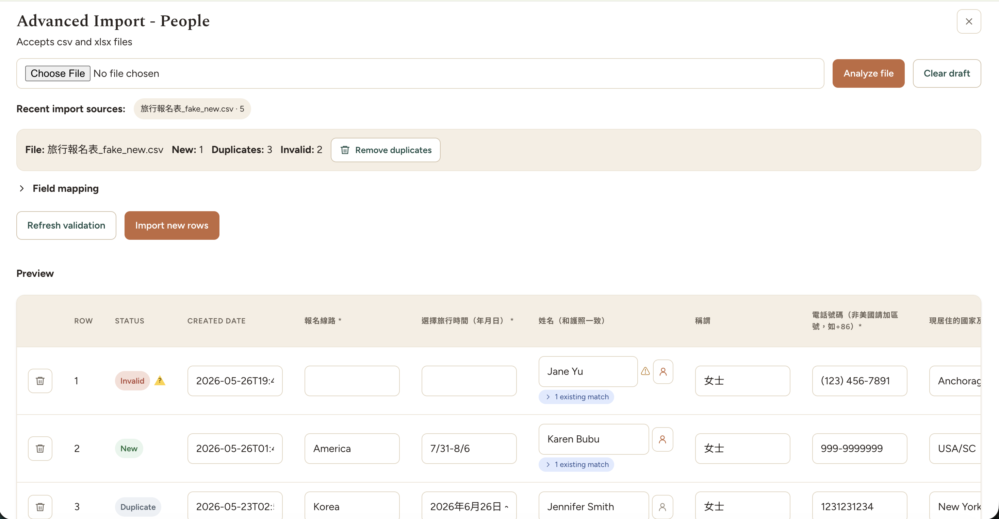

# Travel CRM

A private customer relationship management app for managing travelers, group trips, registrations, contracts, follow-up notes, imports, exports, and operational audit history.

This repository is a public, sanitized display version. Company names, real customer data, private deployment details, credentials, uploaded files, and business-specific records have intentionally been removed or changed.

## Preview

### People Directory

The people directory gives staff a searchable view of traveler records. It is designed for daily lookup work, with profile details, trip participation, sorting, view controls, import access, and export tools available from one screen.



### Person Detail And Trip History

The person detail page keeps a traveler's profile and trip history together. Staff can review contact information, see which trips the person is connected to, and open a trip-specific registration record without losing the broader customer context.



### Trip Directory

The trip directory provides a high-level view of group departures. It helps the team scan upcoming or past trips, compare dates and routes, review traveler counts, and open detailed trip records for operational updates.



### Trip Detail

The trip detail view combines itinerary information, editable trip fields, traveler status summaries, export actions, and the traveler list for that departure. This is the main workspace for managing a single trip after it has been created.



The second trip detail screenshot shows the lower or related portion of the same workflow, including the traveler-facing operational data that staff use to confirm registration status, payment readiness, cancellations, and follow-up needs.



### User Creation

The user creation page is an admin-only area for managing login access. It supports controlled account setup so operational users can work in the CRM without exposing admin-only tools to every staff member.



### Soft Deletes

The soft deletes area gives admins a recovery workflow for records that should not immediately disappear forever. Deleted people, trips, registrations, and contracts can be reviewed and restored when needed, which reduces the risk of accidental data loss.



### Import Review Workflow

The import workflow helps convert spreadsheet data into clean CRM records. It maps columns, previews incoming rows, flags invalid or duplicate entries, and lets users confirm the final import before records are created or updated.



## What It Does

Travel CRM is built for small teams that coordinate group travel and need a reliable way to track the relationship between people, trips, and each traveler's registration status.

Core workflows include:

- Manage traveler profiles with contact details, source information, residence, nationality, age, and internal notes.
- Create and maintain trip records with dates, route details, guide information, reminders, itinerary files, summary notes, and operational fields.
- Link people to trips through registration records.
- Track each registration from inquiry through registered, contract signed, paid, canceled, and related statuses.
- Upload and manage contract files for individual registrations.
- Store contact history so follow-up context stays attached to the right person and trip.
- Search, sort, and switch between list and card views for faster daily operations.
- Import people from CSV or XLSX files with column mapping, validation, duplicate detection, preview, and confirmation.
- Export filtered or complete people, trip, and traveler lists as CSV or XLSX files.
- Restore soft-deleted people, trips, registrations, and contracts through an admin-only deleted records area.
- Review audit metadata for important edits.
- Manage users and admin-only functionality with role-based guards.

## Why This Project Exists

Many lightweight CRM tools are either too generic for travel operations or too heavy for a small internal team. This app focuses on the practical data model that matters most:

- A person can join many trips.
- A trip can have many travelers.
- The registration between a person and a trip carries the operational details.

That structure keeps the main customer profile clean while still preserving trip-specific information such as status, contract files, payment-related fields, emergency contact details, custom fields, and follow-up history.

## Tech Stack

- Frontend: React, TypeScript, Vite, React Router, TanStack Query, React Hook Form, Zod
- Backend: FastAPI, SQLAlchemy, Pydantic
- Data import/export: CSV and XLSX workflows
- Auth: Token-based login with protected routes and admin-only views
- Deployment shape: Docker-ready frontend and backend services

## Application Areas

### People

The people area is the main customer directory. Users can add, edit, search, sort, import, export, and open detailed traveler profiles. The list supports field-specific search and a broader all-fields search for day-to-day lookup.

### Person Detail

Each person detail page shows profile information and trip participation. A person can be added to a trip, and each trip relationship opens into a registration drawer with the operational fields for that specific traveler-trip record.

### Trips

The trip area tracks group departures. Each trip can store date ranges, route information, itinerary uploads, reminder text, guide details, notes, summaries, and traveler counts.

### Registration Drawer

The registration drawer is where the app tracks the most important operational state: status, traveler count, extra guest names, special needs, emergency contact details, custom information, contract upload, and contact history.

### Import Review

The import workflow is designed to reduce messy data entry. It reads a CSV or XLSX file, maps columns to app fields, previews rows, identifies invalid or duplicate records, and lets the user confirm the final import.

### Admin Tools

Admins can manage users, combine trip records, delete or restore records, and review deleted people, trips, registrations, and contracts.

## Data Privacy Notes

This public README intentionally avoids:

- Real company names
- Real traveler or customer names
- Real phone numbers, emails, addresses, or passport information
- Actual trip routes, dates, guide names, links, or financial numbers
- Uploaded contract or itinerary file names
- Internal usernames or staff names
- Production URLs, API hosts, secrets, or environment variable values

## Example Local Development

Create environment files, then start the backend and frontend services.

Backend:

```bash
cd backend
pip install -r requirements.txt
uvicorn main:app --reload
```

Frontend:

```bash
cd frontend
npm install
npm run dev
```

The frontend development server runs on the Vite default port unless configured otherwise.

## Example Docker

The project includes Docker configuration for running the app as containerized services.

```bash
docker compose up --build
```

