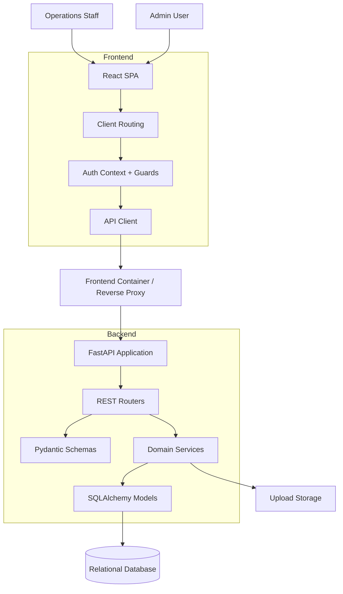
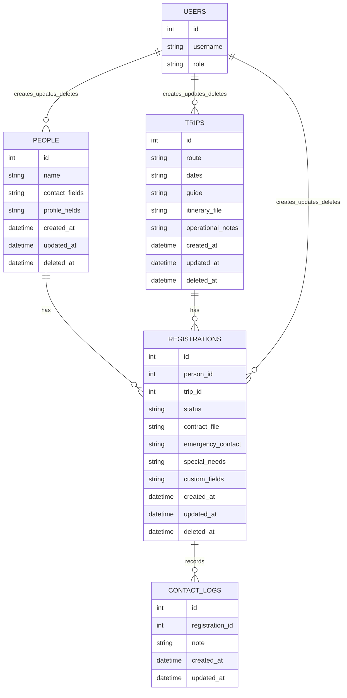
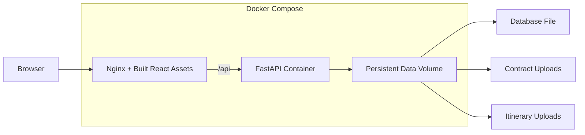
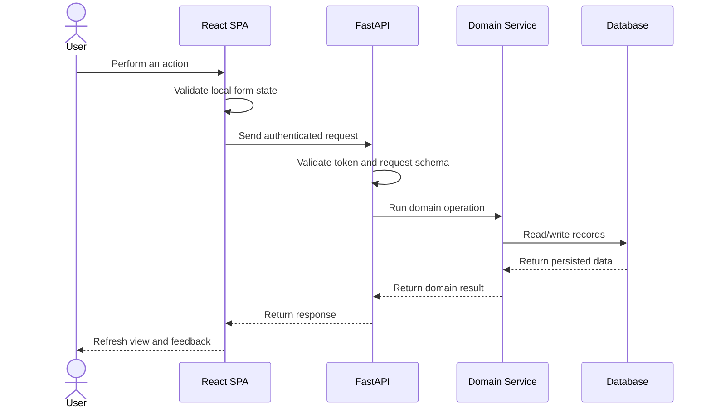

# Architecture Overview

This document describes the system at a portfolio-safe level. It explains how the application is structured without exposing private source code, production settings, credentials, or company data.

## High-Level Shape

## Frontend

The frontend is a React and TypeScript single-page application. It uses route guards to separate authenticated app screens from the login page and admin-only areas.

Primary screens:

- People directory
- Person detail
- Trip directory
- Trip detail
- User management
- Deleted records recovery

Common frontend responsibilities:

- Search and sorting controls.
- List and card presentation modes.
- Form validation before API submission.
- Protected routes for signed-in users.
- Admin-only route protection.
- Import review and export initiation.
- Registration drawer for person-trip operational details.

## Backend

The backend is a FastAPI application organized around domain routers and services.

Primary API areas:

- Authentication
- Users
- People
- Trips
- Registrations
- Contact logs
- Import/export
- Deleted records
- Notifications/reminders

Service responsibilities:

- Authentication and password handling.
- Audit metadata updates.
- Import parsing, mapping, validation, and duplicate detection.
- Contract and itinerary file handling.
- Soft-delete and restore behavior.
- Trip reminder synchronization.

## Data Storage

The application uses a relational model with a central many-to-many relationship:

- One person can join many trips.
- One trip can include many people.
- The registration record between the two stores operational details.

## Deployment Shape

The public description only documents the deployment pattern. It does not include real server IPs, domains, production secrets, private repository URLs, or uploaded files.

## Request Lifecycle

