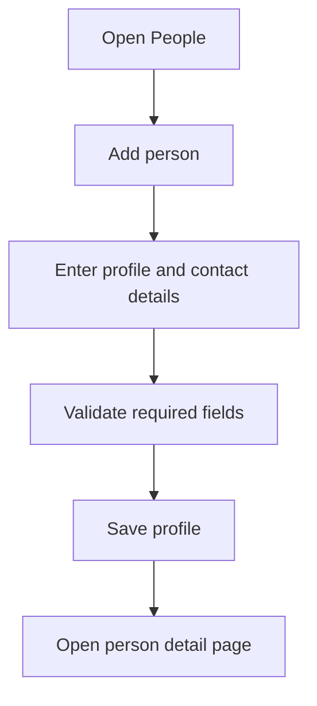
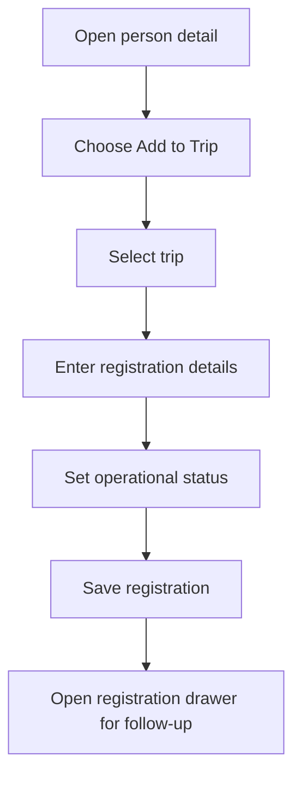
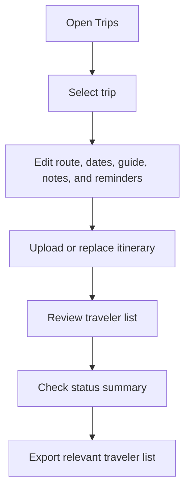
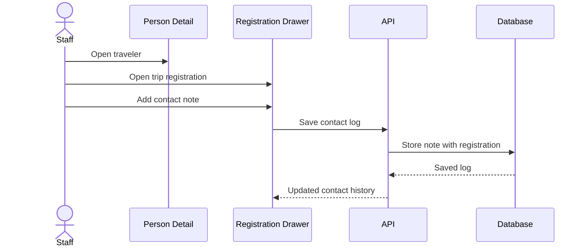
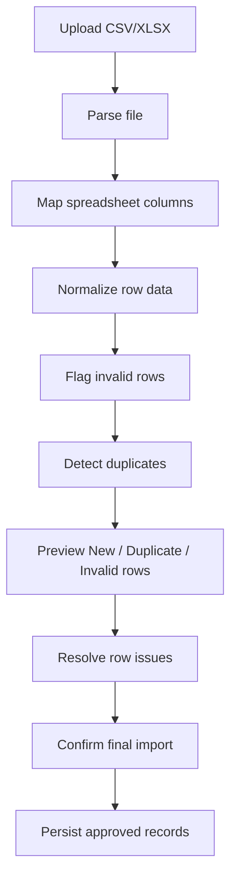
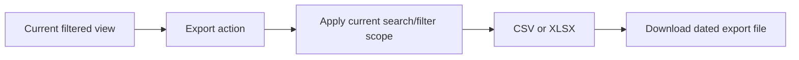
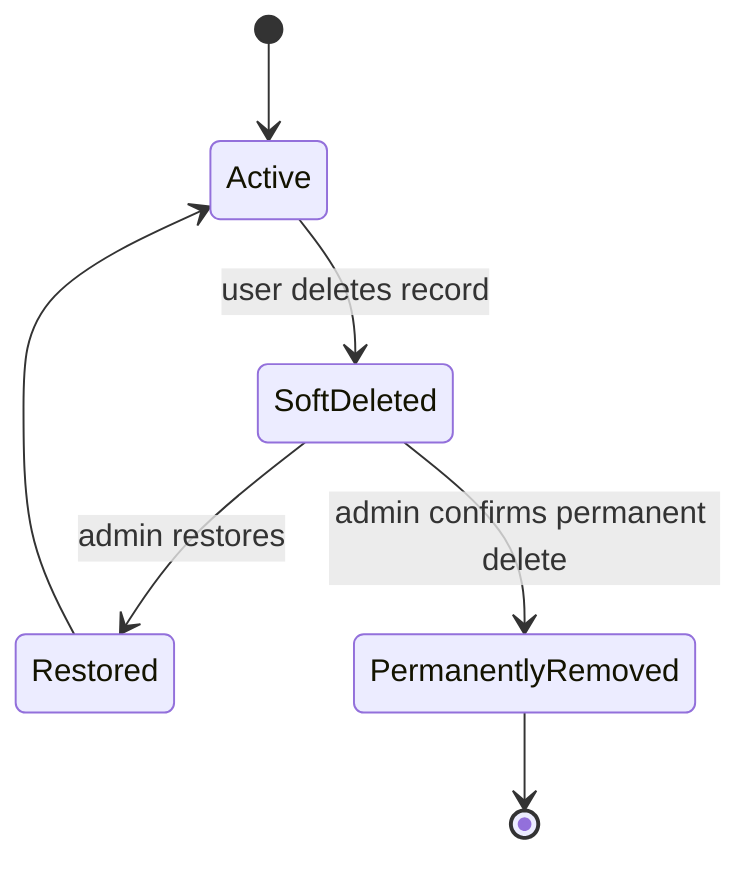

# Workflow Guide

This guide summarizes the important user workflows in the private CRM. It is written for a public portfolio reader, so examples are generalized and do not include private records.

## 1. Create A Traveler Profile

Purpose:

- Gives staff one searchable home for traveler contact information.
- Keeps profile-level data separate from trip-specific operational data.

## 2. Add A Traveler To A Trip

The registration stores details that can vary by trip, such as:

- Number of travelers in the party.
- Custom guest names.
- Registration status.
- Contract file.
- Emergency contact.
- Special needs.
- Flight or payment-related operational notes.
- Contact history.

## 3. Manage A Trip

The trip detail page is the operational workspace for a single departure.

## 4. Contact Follow-Up

Contact logs are attached to the registration rather than only the person. That makes follow-up history specific to the trip context.

## 5. Import People From A Spreadsheet

Design goals:

- Avoid blind bulk inserts.
- Let users see what will happen before data changes.
- Reduce duplicate customer profiles.
- Preserve a draft review state when staff need to pause.

## 6. Export Operational Lists

Exports are used for operational review, backups before major edits, and trip-specific traveler lists.

## 7. Soft Delete And Restore

Soft deletes reduce the risk of accidental data loss. Admins can review deleted people, trips, registrations, and contract records before deciding whether to restore or permanently remove them.

## 8. Admin User Management

Admin-only pages support:

- Creating staff accounts.
- Assigning user/admin roles.
- Restricting sensitive views.
- Keeping deleted-record recovery away from standard users.
